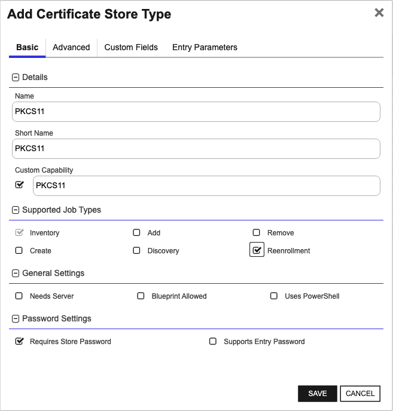
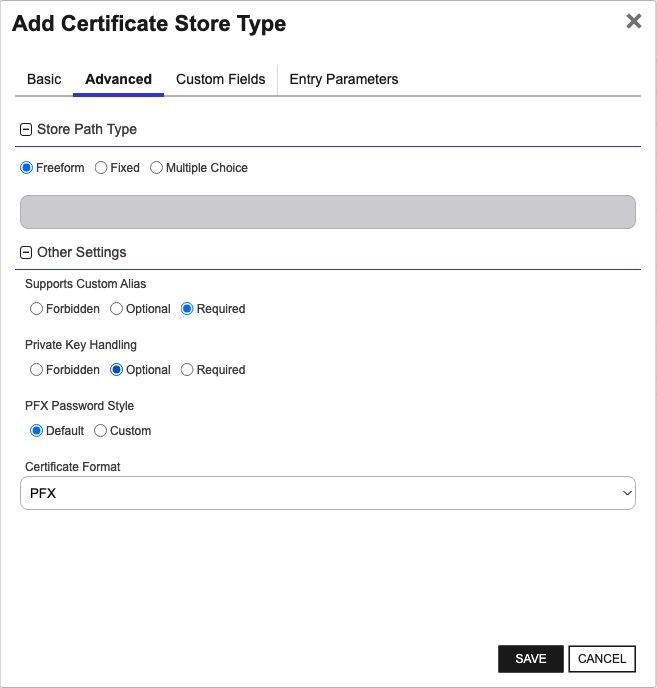
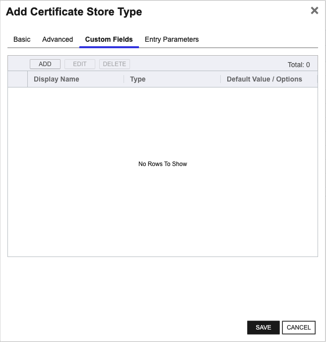
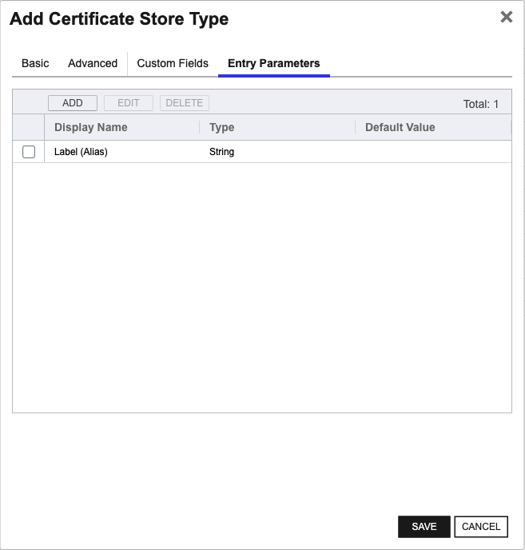

<h1 align="center" style="border-bottom: none">
    PKCS11 Universal Orchestrator Extension
</h1>

<p align="center">
  <!-- Badges -->

<a href="https://github.com/Keyfactor/pkcs11-orchestrator/releases"></a>


</p>

<p align="center">
  <!-- TOC -->
  <a href="#support">
    <b>Support</b>
  </a>
  ·
  <a href="#installation">
    <b>Installation</b>
  </a>
  ·
  <a href="#license">
    <b>License</b>
  </a>
  ·
  <a href="https://github.com/orgs/Keyfactor/repositories?q=orchestrator">
    <b>Related Integrations</b>
  </a>
</p>

## Overview

This Orchestrator Extension allows for interacting with PKCS11-compatible devices to inventory certificates and enroll new certificates with on-device key generation via a reenrollment job.

The PKCS11 orchestrator extensions connects to a PKCS11 Library for a PKCS11-compatible device such as an HSM.
It implements the following capabilities:
1. Inventory - Return all certificates stored on the device accessible by the PIN provided
2. Reenrollment - Perform key generation on the device and create a new certificate with a CSR signed by the generated keys.


## Compatibility

This integration is compatible with Keyfactor Universal Orchestrator version 10.4 and later.

## Support
The PKCS11 Universal Orchestrator extension If you have a support issue, please open a support ticket by either contacting your Keyfactor representative or via the Keyfactor Support Portal at https://support.keyfactor.com.

> To report a problem or suggest a new feature, use the **[Issues](../../issues)** tab. If you want to contribute actual bug fixes or proposed enhancements, use the **[Pull requests](../../pulls)** tab.

## Requirements & Prerequisites

Before installing the PKCS11 Universal Orchestrator extension, we recommend that you install [kfutil](https://github.com/Keyfactor/kfutil). Kfutil is a command-line tool that simplifies the process of creating store types, installing extensions, and instantiating certificate stores in Keyfactor Command.


The PKCS11 device needs to have a corresponding dotnet DLL provided to access it. The configuration of the device and library will be specific to the manufacturer.
A PIN will be used to logon to the device. The PIN used should not be the security officer PIN.
The User PIN provided should have permissions to Generate keys and perform Signings.

The PKCS11 library for the device should be copied and accessible somewhere in the filesystem relative to the Orchestrator. This location will be referenced in the `Store Path` in step two of the Extension Configuration.
Access permissions may need to be reviewed to ensure the Orchestrator can load the PKCS11 library.


## PKCS11 Certificate Store Type

To use the PKCS11 Universal Orchestrator extension, you **must** create the PKCS11 Certificate Store Type. This only needs to happen _once_ per Keyfactor Command instance.


#### Supported Operations

| Operation    | Is Supported                                                                                                           |
|--------------|------------------------------------------------------------------------------------------------------------------------|
| Add          | 🔲 Unchecked        |
| Remove       | 🔲 Unchecked     |
| Discovery    | 🔲 Unchecked  |
| Reenrollment | ✅ Checked |
| Create       | 🔲 Unchecked     |

#### Store Type Creation

##### Using kfutil:
`kfutil` is a custom CLI for the Keyfactor Command API and can be used to create certificate store types.
For more information on [kfutil](https://github.com/Keyfactor/kfutil) check out the [docs](https://github.com/Keyfactor/kfutil?tab=readme-ov-file#quickstart)
   <details><summary>Click to expand PKCS11 kfutil details</summary>

   ##### Using online definition from GitHub:
   This will reach out to GitHub and pull the latest store-type definition
   ```shell
   # PKCS11
   kfutil store-types create PKCS11
   ```

   ##### Offline creation using integration-manifest file:
   If required, it is possible to create store types from the [integration-manifest.json](./integration-manifest.json) included in this repo.
   You would first download the [integration-manifest.json](./integration-manifest.json) and then run the following command
   in your offline environment.
   ```shell
   kfutil store-types create --from-file integration-manifest.json
   ```
   </details>


#### Manual Creation
Below are instructions on how to create the PKCS11 store type manually in
the Keyfactor Command Portal
   <details><summary>Click to expand manual PKCS11 details</summary>

   Create a store type called `PKCS11` with the attributes in the tables below:

   ##### Basic Tab
   | Attribute | Value | Description |
   | --------- | ----- | ----- |
   | Name | PKCS11 | Display name for the store type (may be customized) |
   | Short Name | PKCS11 | Short display name for the store type |
   | Capability | PKCS11 | Store type name orchestrator will register with. Check the box to allow entry of value |
   | Supports Add | 🔲 Unchecked |  Indicates that the Store Type supports Management Add |
   | Supports Remove | 🔲 Unchecked |  Indicates that the Store Type supports Management Remove |
   | Supports Discovery | 🔲 Unchecked |  Indicates that the Store Type supports Discovery |
   | Supports Reenrollment | ✅ Checked |  Indicates that the Store Type supports Reenrollment |
   | Supports Create | 🔲 Unchecked |  Indicates that the Store Type supports store creation |
   | Needs Server | 🔲 Unchecked | Determines if a target server name is required when creating store |
   | Blueprint Allowed | 🔲 Unchecked | Determines if store type may be included in an Orchestrator blueprint |
   | Uses PowerShell | 🔲 Unchecked | Determines if underlying implementation is PowerShell |
   | Requires Store Password | ✅ Checked | Enables users to optionally specify a store password when defining a Certificate Store. |
   | Supports Entry Password | 🔲 Unchecked | Determines if an individual entry within a store can have a password. |

   The Basic tab should look like this:

   

   ##### Advanced Tab
   | Attribute | Value | Description |
   | --------- | ----- | ----- |
   | Supports Custom Alias | Required | Determines if an individual entry within a store can have a custom Alias. |
   | Private Key Handling | Optional | This determines if Keyfactor can send the private key associated with a certificate to the store. Required because IIS certificates without private keys would be invalid. |
   | PFX Password Style | Default | 'Default' - PFX password is randomly generated, 'Custom' - PFX password may be specified when the enrollment job is created (Requires the Allow Custom Password application setting to be enabled.) |

   The Advanced tab should look like this:

   

   > For Keyfactor **Command versions 24.4 and later**, a Certificate Format dropdown is available with PFX and PEM options. Ensure that **PFX** is selected, as this determines the format of new and renewed certificates sent to the Orchestrator during a Management job. Currently, all Keyfactor-supported Orchestrator extensions support only PFX.

   ##### Custom Fields Tab
   Custom fields operate at the certificate store level and are used to control how the orchestrator connects to the remote target server containing the certificate store to be managed. The following custom fields should be added to the store type:

   | Name | Display Name | Description | Type | Default Value/Options | Required |
   | ---- | ------------ | ---- | --------------------- | -------- | ----------- |

   The Custom Fields tab should look like this:

   

   ##### Entry Parameters Tab

   | Name | Display Name | Description | Type | Default Value | Entry has a private key | Adding an entry | Removing an entry | Reenrolling an entry |
   | ---- | ------------ | ---- | ------------- | ----------------------- | ---------------- | ----------------- | ------------------- | ----------- |
   | label | Label (Alias) | Name for the key pair which will also serve as the certificate's alias in Keyfactor | String |  | 🔲 Unchecked | 🔲 Unchecked | 🔲 Unchecked | ✅ Checked |

   The Entry Parameters tab should look like this:

   

   </details>

## Installation

1. **Download the latest PKCS11 Universal Orchestrator extension from GitHub.**

    Navigate to the [PKCS11 Universal Orchestrator extension GitHub version page](https://github.com/Keyfactor/pkcs11-orchestrator/releases/latest). Refer to the compatibility matrix below to determine whether the `net6.0` or `net8.0` asset should be downloaded. Then, click the corresponding asset to download the zip archive.

   | Universal Orchestrator Version | Latest .NET version installed on the Universal Orchestrator server | `rollForward` condition in `Orchestrator.runtimeconfig.json` | `pkcs11-orchestrator` .NET version to download |
   | --------- | ----------- | ----------- | ----------- |
   | Older than `11.0.0` | | | `net6.0` |
   | Between `11.0.0` and `11.5.1` (inclusive) | `net6.0` | | `net6.0` |
   | Between `11.0.0` and `11.5.1` (inclusive) | `net8.0` | `Disable` | `net6.0` |
   | Between `11.0.0` and `11.5.1` (inclusive) | `net8.0` | `LatestMajor` | `net8.0` |
   | `11.6` _and_ newer | `net8.0` | | `net8.0` |

    Unzip the archive containing extension assemblies to a known location.

    > **Note** If you don't see an asset with a corresponding .NET version, you should always assume that it was compiled for `net6.0`.

2. **Locate the Universal Orchestrator extensions directory.**

    * **Default on Windows** - `C:\Program Files\Keyfactor\Keyfactor Orchestrator\extensions`
    * **Default on Linux** - `/opt/keyfactor/orchestrator/extensions`

3. **Create a new directory for the PKCS11 Universal Orchestrator extension inside the extensions directory.**

    Create a new directory called `pkcs11-orchestrator`.
    > The directory name does not need to match any names used elsewhere; it just has to be unique within the extensions directory.

4. **Copy the contents of the downloaded and unzipped assemblies from __step 2__ to the `pkcs11-orchestrator` directory.**

5. **Restart the Universal Orchestrator service.**

    Refer to [Starting/Restarting the Universal Orchestrator service](https://software.keyfactor.com/Core-OnPrem/Current/Content/InstallingAgents/NetCoreOrchestrator/StarttheService.htm).


6. **(optional) PAM Integration**

    The PKCS11 Universal Orchestrator extension is compatible with all supported Keyfactor PAM extensions to resolve PAM-eligible secrets. PAM extensions running on Universal Orchestrators enable secure retrieval of secrets from a connected PAM provider.

    To configure a PAM provider, [reference the Keyfactor Integration Catalog](https://keyfactor.github.io/integrations-catalog/content/pam) to select an extension and follow the associated instructions to install it on the Universal Orchestrator (remote).


> The above installation steps can be supplemented by the [official Command documentation](https://software.keyfactor.com/Core-OnPrem/Current/Content/InstallingAgents/NetCoreOrchestrator/CustomExtensions.htm?Highlight=extensions).


## Defining Certificate Stores


### Store Creation

#### Manually with the Command UI

<details><summary>Click to expand details</summary>

1. **Navigate to the _Certificate Stores_ page in Keyfactor Command.**

    Log into Keyfactor Command, toggle the _Locations_ dropdown, and click _Certificate Stores_.

2. **Add a Certificate Store.**

    Click the Add button to add a new Certificate Store. Use the table below to populate the **Attributes** in the **Add** form.

   | Attribute | Description |
   | --------- | ----------- |
   | Category | Select "PKCS11" or the customized certificate store name from the previous step. |
   | Container | Optional container to associate certificate store with. |
   | Client Machine | Not used.  Enter any non-empty value |
   | Store Path | The absolute path to the PKCS11 library DLL |
   | Orchestrator | Select an approved orchestrator capable of managing `PKCS11` certificates. Specifically, one with the `PKCS11` capability. |

</details>


#### Using kfutil CLI

<details><summary>Click to expand details</summary>

1. **Generate a CSV template for the PKCS11 certificate store**

    ```shell
    kfutil stores import generate-template --store-type-name PKCS11 --outpath PKCS11.csv
    ```
2. **Populate the generated CSV file**

    Open the CSV file, and reference the table below to populate parameters for each **Attribute**.

   | Attribute | Description |
   | --------- | ----------- |
   | Category | Select "PKCS11" or the customized certificate store name from the previous step. |
   | Container | Optional container to associate certificate store with. |
   | Client Machine | Not used.  Enter any non-empty value |
   | Store Path | The absolute path to the PKCS11 library DLL |
   | Orchestrator | Select an approved orchestrator capable of managing `PKCS11` certificates. Specifically, one with the `PKCS11` capability. |

3. **Import the CSV file to create the certificate stores**

    ```shell
    kfutil stores import csv --store-type-name PKCS11 --file PKCS11.csv
    ```

</details>


#### PAM Provider Eligible Fields
<details><summary>Attributes eligible for retrieval by a PAM Provider on the Universal Orchestrator</summary>

If a PAM provider was installed _on the Universal Orchestrator_ in the [Installation](#Installation) section, the following parameters can be configured for retrieval _on the Universal Orchestrator_.

   | Attribute | Description |
   | --------- | ----------- |
   | StorePassword | Password to use when reading/writing to store |

Please refer to the **Universal Orchestrator (remote)** usage section ([PAM providers on the Keyfactor Integration Catalog](https://keyfactor.github.io/integrations-catalog/content/pam)) for your selected PAM provider for instructions on how to load attributes orchestrator-side.
> Any secret can be rendered by a PAM provider _installed on the Keyfactor Command server_. The above parameters are specific to attributes that can be fetched by an installed PAM provider running on the Universal Orchestrator server itself.

</details>


> The content in this section can be supplemented by the [official Command documentation](https://software.keyfactor.com/Core-OnPrem/Current/Content/ReferenceGuide/Certificate%20Stores.htm?Highlight=certificate%20store).


## License

Apache License 2.0, see [LICENSE](LICENSE).

## Related Integrations

See all [Keyfactor Universal Orchestrator extensions](https://github.com/orgs/Keyfactor/repositories?q=orchestrator).