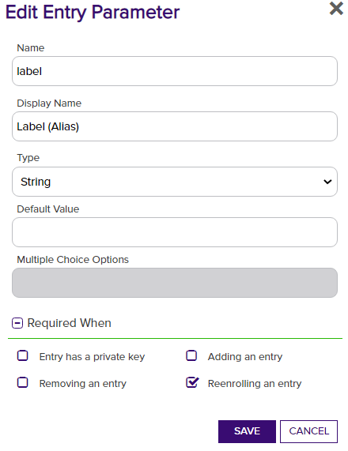

# PKCS11

This Orchestrator Extension allows for interacting with PKCS11-compatible devices to inventory certificates and enroll new certificates with on-device key generation via a reenrollment job.

#### Integration status: Production - Ready for use in production environments.

## About the Keyfactor Universal Orchestrator Extension

This repository contains a Universal Orchestrator Extension which is a plugin to the Keyfactor Universal Orchestrator. Within the Keyfactor Platform, Orchestrators are used to manage “certificate stores” &mdash; collections of certificates and roots of trust that are found within and used by various applications.

The Universal Orchestrator is part of the Keyfactor software distribution and is available via the Keyfactor customer portal. For general instructions on installing Extensions, see the “Keyfactor Command Orchestrator Installation and Configuration Guide” section of the Keyfactor documentation. For configuration details of this specific Extension see below in this readme.

The Universal Orchestrator is the successor to the Windows Orchestrator. This Orchestrator Extension plugin only works with the Universal Orchestrator and does not work with the Windows Orchestrator.

## Support for PKCS11

PKCS11 is supported by Keyfactor for Keyfactor customers. If you have a support issue, please open a support ticket with your Keyfactor representative.

###### To report a problem or suggest a new feature, use the **[Issues](../../issues)** tab. If you want to contribute actual bug fixes or proposed enhancements, use the **[Pull requests](../../pulls)** tab.

---

## Platform Specific Notes

The Keyfactor Universal Orchestrator may be installed on either Windows or Linux based platforms. The certificate operations supported by a capability may vary based what platform the capability is installed on. The table below indicates what capabilities are supported based on which platform the encompassing Universal Orchestrator is running.
| Operation | Win | Linux |
|-----|-----|------|
|Supports Management Add|  |  |
|Supports Management Remove|  |  |
|Supports Create Store|  |  |
|Supports Discovery|  |  |
|Supports Renrollment|&check; |  |
|Supports Inventory|&check; |  |

---

## Use Case

The PKCS11 orchestrator extensions connects to a PKCS11 Library for a PKCS11-compatible device such as an HSM.
It implements the following capabilities:
1. Inventory - Return all certificates stored on the device accessible by the PIN provided
2. Reenrollment - Perform key generation on the device and create a new certificate with a CSR signed by the generated keys.

## PKCS11 Library and Device Configuration

The PKCS11 device needs to have a corresponding dotnet DLL provided to access it. The configuration of the device and library will be specific to the manufacturer.
A PIN will be used to logon to the device. The PIN used should not be the security officer PIN.
The User PIN provided should have permissions to Generate keys and perform Signings.

The PKCS11 library for the device should be copied and accessible somewhere in the filesystem relative to the Orchestrator. This location will be referenced in the `Store Path` in step two of the Extension Configuration.
Access permissions may need to be reviewed to ensure the Orchestrator can load the PKCS11 library.

## PKCS11 Orchestrator Extension Configuration

**1. Create the New Certificate Store Type for the PKCS11 orchestrator extension**

In Keyfactor Command create a new Certificate Store Type similar to the one below by clicking Settings (the gear icon in the top right) => Certificate Store Types => Add:

Leave other settings as default in Advanced and Custom Fields. Add a single Entry Parameter for the Label (Alias) below:

**2. Create a new PKCS11 Certificate Store**

After the Certificate Store Type has been configured, a new PKCS11 Certificate Store can be created. When creating the store set the following values:

| Certificate Store parameter | Value |
| - | - |
| Client Machine | Any display name for the store |
| Store Path | The absolute path to the PKCS11 library DLL |
| Store Password | The PIN to access the device |

The Client Machine is not used and can just be a helpful name for labeling the store. The Store Path should look like `C:\Program Files\manufacturer\device\device_pkcs11.dll`.

**3. (Optional) Generate a new key and Enroll a certificate**

Selecting Reenrollment for the store will trigger generation of a new key pair for creating a certificate. The Label (Alias) should be set with the name for the key pair which will also serve as the certificate's alias in Keyfactor.

### License
[Apache](https://apache.org/licenses/LICENSE-2.0)

